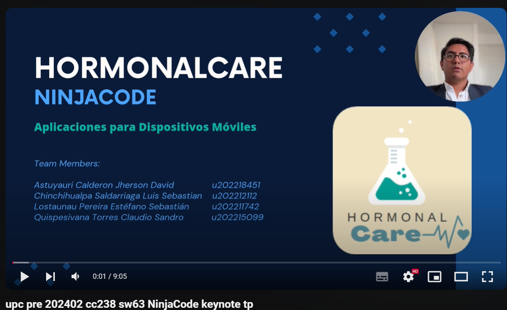

# hormonal_care_expos

# Ninja Code - Desarrollo de Aplicaciones Móviles

Este repositorio contiene las presentaciones, la práctica parcial y final del curso de **Desarrrollo de Aplicaciones Móviles** de la **Universidad Peruana de Ciencias Aplicadas (UPC)**. Además, está relacionado con el desarrollo del proyecto **HormonalCare** por **NinjaCode**.

## Exposiciones

### Parcial

1. **UPC Pre 202402 CC238 SW63 NinjaCode Keynote TP**  
   _[Enlace al video](https://youtu.be/ZG19M0FQmBo)_

   En esta exposición, presentamos la introducción y las principales funcionalidades de nuestra aplicación **HormonalCare**, enfocada en la gestión y seguimiento médico de enfermedades hormonales en Perú. Es decir, presentamos el primer avance de nuestra aplicación móvil con algunas conexiones funcionales de frontend con backend.
   # Ninja Code - Desarrollo de Aplicaciones Móviles

Este repositorio contiene las presentaciones, la práctica parcial y final del curso de **Desarrrollo de Aplicaciones Móviles** de la **Universidad Peruana de Ciencias Aplicadas (UPC)**. Además, está relacionado con el desarrollo del proyecto **HormonalCare** por **NinjaCode**.

## Exposiciones

### Parcial

1. **UPC Pre 202402 CC238 SW63 NinjaCode Keynote TP**  
   _[Enlace al video](https://youtu.be/ZG19M0FQmBo)_

   En esta exposición, presentamos la introducción y las principales funcionalidades de nuestra aplicación **HormonalCare**, enfocada en la gestión y seguimiento médico de enfermedades hormonales en Perú. Es decir, presentamos el primer avance de nuestra aplicación móvil con algunas conexiones funcionales de frontend con backend.

   

### Final

(Sección reservada para la práctica final del curso)

## HormonalCare

### Descripción del proyecto

**HormonalCare** es una aplicación diseñada para mejorar la comunicación entre pacientes y médicos en el seguimiento de enfermedades hormonales. Desarrollada por **NinjaCode**, la app busca asegurar una gestión eficiente y segura de los datos médicos, con un enfoque en la accesibilidad y la personalización del seguimiento para cada usuario.

### Objetivos principales del proyecto

- Facilitar el monitoreo de condiciones hormonales.
- Garantizar la seguridad de los datos médicos a través de protocolos avanzados.
- Ofrecer una experiencia de usuario optimizada para médicos y pacientes.

### Final

(Sección reservada para la práctica final del curso)

## HormonalCare

### Descripción del proyecto

**HormonalCare** es una aplicación diseñada para mejorar la comunicación entre pacientes y médicos en el seguimiento de enfermedades hormonales. Desarrollada por **NinjaCode**, la app busca asegurar una gestión eficiente y segura de los datos médicos, con un enfoque en la accesibilidad y la personalización del seguimiento para cada usuario.

### Objetivos principales del proyecto

- Facilitar el monitoreo de condiciones hormonales.
- Garantizar la seguridad de los datos médicos a través de protocolos avanzados.
- Ofrecer una experiencia de usuario optimizada para médicos y pacientes.

